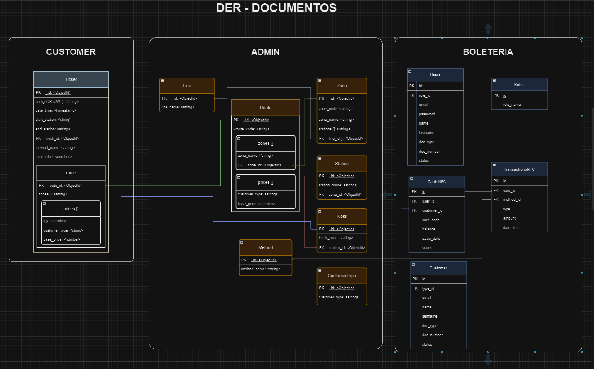

# MiTren Proyecto Backend [NodeJS, Typescript, Mongoose]

### En cuanto al Análisis tenemos:

#### Diagrama Entidad Relación (DER)

Está pensado aplicando patrones de desnormalización, computed pattem, relaciones y cardinalidades al modelo ER.

#### Configuraciones

- [Configuraciones de Desarrollo](./documentation/config-development.md)

- [Configuraciones de SO](./documentation/config-ubuntu.md)

- [Documentación VeriPagos](./documentation/doc-veripagos-qr.md)
